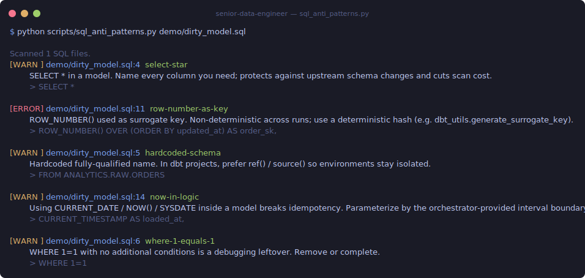

# senior-data-engineer

A Claude Skill that answers data-engineering questions with citation-backed guidance and checks code for common errors on request. Built as a thin dispatcher (`SKILL.md`) that loads topical references on demand, plus stack-agnostic static-analysis scripts.

## Install

```bash
npx skills add AngelPedroza/senior-data-engineer
```

This registers the skill with your Claude Code / Claude Agent SDK environment. Once installed, the skill is auto-invoked when you ask data-engineering questions (design, review, debugging, modeling, DataOps).

## Quick demo — catching real bugs in SQL

Pointed at a realistic sloppy dbt model ([`demo/dirty_model.sql`](./demo/dirty_model.sql)), `scripts/sql_anti_patterns.py` flags **5 findings (1 error, 4 warnings)** in under a second — no config, no cloud SDKs, pure Python stdlib:



Every finding is actionable: named rule ID, a one-line explanation, and the offending snippet. Exit code is non-zero when findings exist, so it drops straight into CI. The other five scripts (`dbt_project_audit.py`, `dag_idempotency_check.py`, `schema_contract_diff.py`, `data_profile.py`, `lifecycle_checklist.py`) follow the same shape — see [What it covers](#what-it-covers) below.

## What it covers

**Six-phase workflow** inline in `SKILL.md`:
1. Clarify the data contract
2. Choose the right tool
3. Model the data
4. Implement with discipline (SQL/dbt, Spark, Airflow/Dagster, streaming)
5. Verify before declaring done
6. Operationalize

**17 framework references** (lifecycle stages + undercurrents + concepts):
- Generation, Storage, Ingestion, Transformation, Serving
- Security, Data Management, DataOps, Architecture, Orchestration, Software Engineering
- FinOps, Maturity Model, Type A vs. B roles, Data Mesh, ETL vs. ELT

**7 playbooks** (procedural runbooks):
- Design a new pipeline
- Review a DE pull request
- Choose a technology
- Fix a broken data job
- Model a fact table
- Plan a backfill
- Design a data contract

**6 runnable scripts** (Python 3.10+, stdlib-first, no cloud SDKs):

| Script | Purpose |
|---|---|
| `sql_anti_patterns.py` | Scan `.sql` files for `SELECT *`, `TRUNCATE+INSERT`, `ROW_NUMBER` surrogate keys, `CURRENT_DATE` in models, hardcoded refs |
| `dbt_project_audit.py` | Audit a dbt project for missing tests, incremental models without `unique_key`, orphaned models, sources without freshness |
| `dag_idempotency_check.py` | Lint Airflow / Dagster / Prefect DAGs for `datetime.now()` in tasks, missing retries / timeouts, `catchup=True`, top-level side effects |
| `schema_contract_diff.py` | Diff two schemas (SQL DDL or JSON Schema); classify each change as additive, breaking, or semantic; non-zero exit on breaking |
| `data_profile.py` | Profile a CSV / Parquet for row counts, null %, cardinality, grain and PK candidates |
| `lifecycle_checklist.py` | Interactive CLI that walks the Phase-1 data-contract questions and emits a markdown design skeleton |

Each script supports `--help` and `--json`. Exit code is non-zero when findings exist, so CI can block on them.

## Usage examples

In Claude Code once the skill is installed:

> *"Review the SQL in `models/marts/fct_orders.sql` — anything I should fix before merging?"*
> Skill loads `playbooks/review-data-pr.md` + optionally runs `scripts/sql_anti_patterns.py`.

> *"I need to build a new pipeline that ingests Stripe events into BigQuery. Where do I start?"*
> Skill loads `playbooks/design-new-pipeline.md` + `framework/03-ingestion.md` and walks the contract first.

> *"Explain the difference between ETL and ELT and when each applies."*
> Skill loads `framework/concept-etl-vs-elt.md`.

> *"Data Mesh — what is it and should we adopt it?"*
> Skill loads `framework/concept-data-mesh.md` + `framework/concept-maturity-model.md`.

Or invoke a script directly:

```bash
python scripts/sql_anti_patterns.py path/to/models/
python scripts/dag_idempotency_check.py path/to/dags/
python scripts/schema_contract_diff.py old_schema.sql new_schema.sql
```

## Sources and attribution

The skill synthesizes industry-standard practice from multiple sources. Reference files cite the primary sources in their header (`**Concept anchor:**` + `**Also drawing from:**`).

**Primary sources cited:**
- Joe Reis & Matt Housley — *Fundamentals of Data Engineering* (O'Reilly, 2022) — the lifecycle + undercurrents taxonomy that structures the skill
- Ralph Kimball & Margy Ross — *The Data Warehouse Toolkit*, 3rd ed. (Wiley, 2013) — dimensional modeling
- Bill Inmon — *Building the Data Warehouse*, 4th ed. (Wiley, 2005) — 3NF enterprise DW
- Dan Linstedt — Data Vault 2.0 public material
- Zhamak Dehghani — Data Mesh articles on [martinfowler.com (2019)](https://martinfowler.com/articles/data-monolith-to-mesh.html) and [(2020)](https://martinfowler.com/articles/data-mesh-principles.html); *Data Mesh* (O'Reilly, 2022)
- Martin Kleppmann — *Designing Data-Intensive Applications* (O'Reilly, 2017)
- Nicole Forsgren, Jez Humble, Gene Kim — *Accelerate* (IT Revolution, 2018) — DORA metrics
- DAMA International — *DMBOK2* — data management body of knowledge
- Chad Sanderson / Andrew Jones — data contracts writing (2023–2024)
- FinOps Foundation framework ([finops.org](https://www.finops.org))
- Primary project docs: dbt, Apache Airflow, Dagster, Prefect, Snowflake, BigQuery, Databricks, Apache Iceberg / Delta Lake / Hudi, Apache Kafka, Debezium

All prose is written fresh — no verbatim copying from any source. Concepts are taught in the skill's own voice with citations back to each primary source.

## Contributing

Issues and PRs welcome. Rules of thumb for additions:
- Every reference file opens with a **Concept anchor** (primary source) and **Also drawing from** (2+ additional sources)
- No verbatim copying from any book, paper, or proprietary doc
- Scripts must be stdlib-first, stack-agnostic, and work without cloud SDKs
- Anti-patterns sections are encouraged — "what not to do" is often more useful than "what to do"

## License

MIT — see [LICENSE](./LICENSE). © 2026 Angel Pedroza.
